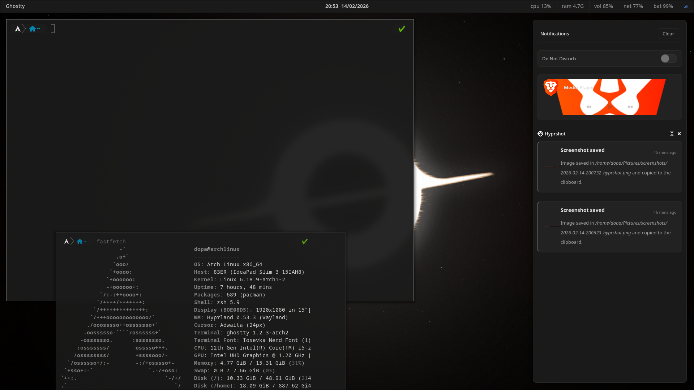

# Arch Linux Hyprland Dotfiles - Minimal Gray Theme

> Inspired by the Pixies from The Fairly OddParents - everything is turned off and minimal! 🖤

A minimalist grayscale Hyprland configuration for Arch Linux featuring a clean, monochromatic aesthetic.

## 🎨 Theme Philosophy

This setup embraces **extreme minimalism** with a pure grayscale color palette. No flashy colors, no distractions - just clean grays from `#1a1a1a` to `#f0f0f0`. Perfect for those who appreciate simplicity and focus.

## 📸 Screenshots



## ✨ Features

- 🎨 **Pure Grayscale Theme** - Monochromatic aesthetic across all components
- ⚡ **Hyprland** - Dynamic tiling Wayland compositor
- 👻 **Ghostty** - Modern GPU-accelerated terminal (configurable)
- 🦊 **Brave Browser** - Privacy-focused browser (configurable)
- 📋 **SwayNC** - Notification center with media controls
- 🚀 **Rofi** - Application launcher with fuzzy search
- 📊 **Waybar** - Customizable status bar
- 🔒 **Hyprlock** - Screen lock with blur effects
- 🔋 **Hypridle** - Idle management daemon
- 📋 **Cliphist** - Clipboard manager with rofi integration

## 📁 Repository Structure

```
.
├── .config
│   ├── ghostty
│   │   └── config
│   ├── hypr
│   │   ├── config
│   │   │   ├── env.conf
│   │   │   ├── keybinds.conf
│   │   │   ├── look-and-feel.conf
│   │   │   ├── monitors.conf
│   │   │   └── rules.conf
│   │   ├── hypridle.conf
│   │   ├── hyprland.conf
│   │   ├── hyprlock.conf
│   │   └── scripts
│   │       ├── brightness.sh
│   │       ├── lock.sh
│   │       ├── volume.sh
│   │       └── wallpaper.sh
│   ├── rofi
│   │   ├── config.rasi
│   │   └── themes
│   │       ├── cliphist.rasi
│   │       └── minimal-gray.rasi
│   ├── swaync
│   │   ├── config.json
│   │   └── style.css
│   └── waybar
│       ├── config.jsonc
│       └── style.css
```

## 📦 Installation

### Prerequisites

This configuration is designed for **Ghostty** as the terminal and **Brave** as the browser, but you can easily change these in the Hyprland configuration files located in `~/.config/hypr/`.

To modify:
- Terminal: Edit `~/.config/hypr/config/env.conf` or `~/.config/hypr/config/keybinds.conf`
- Browser: Edit `~/.config/hypr/config/keybinds.conf`

### Required Packages

Install the following packages using pacman:

```bash
# Core Hyprland and dependencies
sudo pacman -S hyprland
sudo pacman -S hyprpaper
sudo pacman -S hypridle
sudo pacman -S hyprlock
sudo pacman -S swww

# Wayland essentials
sudo pacman -S qt5-wayland qt6-wayland
sudo pacman -S xdg-desktop-portal-hyprland

# Audio
sudo pacman -S pipewire wireplumber
sudo pacman -S pavucontrol

# Notification and UI
sudo pacman -S swaync
sudo pacman -S rofi-wayland
sudo pacman -S waybar

# Clipboard
sudo pacman -S cliphist wl-clipboard

# System tray utilities
sudo pacman -S blueman
sudo pacman -S network-manager-applet

# Brightness and power management
sudo pacman -S brightnessctl
sudo pacman -S playerctl

# File manager and utilities
sudo pacman -S thunar
sudo pacman -S grim slurp
sudo pacman -S wl-clipboard

# Fonts
sudo pacman -S ttf-iosevka-nerd
sudo pacman -S ttf-jetbrains-mono-nerd
```

### Optional packages

```bash
# Terminal (if you want Ghostty)
# Install from AUR: yay -S ghostty

# Browser
yay -S brave-bin

# Additional utilities
sudo pacman -S btop
sudo pacman -S neofetch
sudo pacman -S htop
sudo pacman -S polkit-gnome
```

### Installation Steps

1. **Backup your existing configuration**
   ```bash
   mkdir -p ~/dotfiles-backup
   cp -r ~/.config/hypr ~/dotfiles-backup/
   cp -r ~/.config/waybar ~/dotfiles-backup/
   cp -r ~/.config/rofi ~/dotfiles-backup/
   cp -r ~/.config/swaync ~/dotfiles-backup/
   cp -r ~/.config/ghostty ~/dotfiles-backup/
   ```

2. **Clone this repository**
   ```bash
   git clone https://github.com/yourusername/dotfiles.git
   cd dotfiles
   ```

3. **Copy configuration files**
   ```bash
   cp -r .config/* ~/.config/
   ```

4. **Make scripts executable**
   ```bash
   chmod +x ~/.config/hypr/scripts/*.sh
   ```

5. **Reload Hyprland**
   ```bash
   hyprctl reload
   ```

## 🎨 Color Palette

The entire setup uses a grayscale palette:

| Color | Hex | Usage |
|-------|-----|-------|
| Black | `#1a1a1a` | Backgrounds |
| Dark Gray | `#2a2a2a` | Borders, selections |
| Medium Gray | `#707070` | Active borders, accents |
| Light Gray | `#a0a0a0` | Secondary text |
| White | `#e0e0e0` | Primary text |

## ⌨️ Key Bindings

> **Note:** `Super` key = Windows key / Command key

### Applications
| Key | Action |
|-----|--------|
| `Super + T` | Open terminal (Ghostty) |
| `Super + B` | Open browser (Brave) |
| `Super + A` | Application launcher (Rofi) |
| `Super + F` | File manager |
| `Super + N` | Toggle notifications (SwayNC) |
| `Super + C` | Clipboard history (Cliphist) |

### Window Management
| Key | Action |
|-----|--------|
| `Super + Q` | Close active window |
| `Super + M` | Exit Hyprland |
| `Super + Return` | Toggle fullscreen |
| `Super + Alt + Space` | Toggle floating mode |
| `Super + O` | Pseudo-tile |
| `Super + J` | Toggle split direction |

### Window Navigation (Vim-style)
| Key | Action |
|-----|--------|
| `Super + H/J/K/L` | Move focus (left/down/up/right) |
| `Super + Shift + H/J/K/L` | Move window |
| `Super + Ctrl + H/J/K/L` | Resize window |

### Workspaces
| Key | Action |
|-----|--------|
| `Super + 1-9/0` | Switch to workspace 1-10 |
| `Super + Shift + 1-9/0` | Move window to workspace (silent) |
| `Super + Left/Right` | Previous/Next workspace |
| `Super + S` | Toggle special workspace |
| `Super + Shift + S` | Move to special workspace |

### System Controls
| Key | Action |
|-----|--------|
| `Super + Alt + L` | Lock screen |
| `Super + W` | Change wallpaper (random) |
| `Ctrl + Escape` | Toggle Waybar |

### Media Controls
| Key | Action |
|-----|--------|
| `Volume Up/Down` | Adjust volume |
| `Mute` | Toggle mute |
| `Brightness Up/Down` | Adjust screen brightness |
| `Play/Pause` | Media play/pause |
| `Next/Previous` | Media next/previous track |

### Screenshots (Hyprshot)
| Key | Action |
|-----|--------|
| `Super + P` | Region screenshot |
| `Super + Alt + P` | Window screenshot |
| `Super + Shift + P` | Full screen screenshot |
| `Super + Ctrl + P` | Region to clipboard |

### Mouse Actions
| Key | Action |
|-----|--------|
| `Super + Left Click` | Move window |
| `Super + Right Click` | Resize window |

## 🔧 Customization

### Changing Terminal or Browser

Edit `~/.config/hypr/config/keybinds.conf` and change:
```conf
# Terminal
bind = $mainMod, Return, exec, your-terminal

# Browser
bind = $mainMod, B, exec, your-browser
```

### Adjusting Colors

All colors are defined in:
- Hyprland: `~/.config/hypr/config/look-and-feel.conf`
- Waybar: `~/.config/waybar/style.css`
- Rofi: `~/.config/rofi/themes/minimal-gray.rasi`
- SwayNC: `~/.config/swaync/style.css`
- Ghostty: `~/.config/ghostty/config`
- Hyprlock: `~/.config/hypr/hyprlock.conf`

### Changing Font

The default font is **Iosevka Nerd Font**. To change it:

1. Install your preferred Nerd Font
2. Update font settings in each config file
3. Reload applications

## 🐛 Troubleshooting

### SwayNC notifications not showing
```bash
# Restart SwayNC
killall swaync
swaync &
```

### Rofi not launching
```bash
# Check if rofi-wayland is installed
pacman -Q rofi-wayland
```

### Hyprland errors on startup
```bash
# Check logs
hyprctl clients
journalctl -b | grep hypr
```

### Scripts not working
```bash
# Make sure scripts are executable
chmod +x ~/.config/hypr/scripts/*.sh
```

## 📚 Resources

- [Hyprland Wiki](https://wiki.hyprland.org/)
- [Hyprland GitHub](https://github.com/hyprwm/Hyprland)
- [Ghostty Terminal](https://github.com/ghostty-org/ghostty)
- [Waybar](https://github.com/Alexays/Waybar)
- [Rofi](https://github.com/davatorium/rofi)
- [SwayNC](https://github.com/ErikReider/SwayNotificationCenter)
- [Arch Wiki - Hyprland](https://wiki.archlinux.org/title/Hyprland)

## 🤝 Contributing

Feel free to open issues or submit pull requests if you have suggestions or improvements!

## 📝 License

This configuration is free to use and modify. No warranty provided.

## 💖 Credits

- Inspired by the minimalist aesthetic of The Fairly OddParents' Pixies
- Color scheme: Pure grayscale minimal theme
- Based on the Arch Linux and Hyprland communities

---

**Note:** This is a personal configuration. Adjust it to your needs and preferences!
